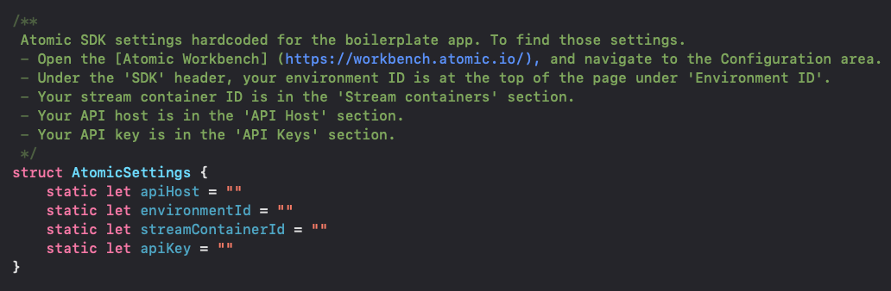

# iOS Boilerplate App

This is a boilerplate app that can be forked to get you started with the Atomic SDK for iOS.

The code is based around the [Atomic iOS SDK documentation](https://documentation.atomic.io/sdks/ios) and designed to get you up and running as quickly as possible, not necessarily as best practice. 

Therefore we do NOT recommend uploading this boilerplate app or any of its modifications to AppStore, or using it in the production environment.

## Quick Start

This boilerplate app is written as an Xcode project, whose project file is `iOSBoilerplate.xcodeproj`, located in the folder `iOSBoilerplate`. Before opening this project, make sure you have the latest Xcode installed (currently v14.3 (14E222b)). For simplified configuration, the Atomic SDK is imported using Swift Package Manager, so just open the Xcode project and choose File > Packages > Update to Latest Package Versions to get the latest SDK. In your real Xcode projects, Atomic SDK can be installed as the [Atomic iOS SDK installation documentation](https://documentation.atomic.io/sdks/ios#installation) instructs.

### SDK configuration
The app won't run out of the box, you will need to add your own values to fill the struct `AtomicSettings`, located in file `iOSBoilerplate/Atomic/AtomicSettings.swift`.

To find the correct values:

    - Open the [Atomic Workbench] (https://workbench.atomic.io/), and navigate to the Configuration area.
    - Under the 'SDK' header, your environment ID is at the top of the page under 'Environment ID'.
    - Your stream container ID is in the 'Stream containers' section.
    - Your API host is in the 'API Host' section.
    - Your API key can be found (or created) in the 'API Keys' section.

You will also need to return a valid JSON Web Token (JWT) in `iOSBoilerplate/Atomic/AtomicSessionDelegate.swift` for authentication. See [SDK Authentication](https://documentation.atomic.io/sdks/auth-SDK) for more details on how to generate a JWT.

## Runtime Variables

For an example of how to set runtime variables in your code, check out the branch [feature/runtime-variables](https://github.com/atomic-app/boilerplate-ios-sdk/tree/feature/runtime-variables).

## Notifications

For an example of how to set push notifications in your code, check out the branch [feature/push-notifications](https://github.com/atomic-app/boilerplate-ios-sdk/tree/feature/push-notifications).
